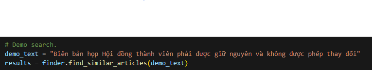
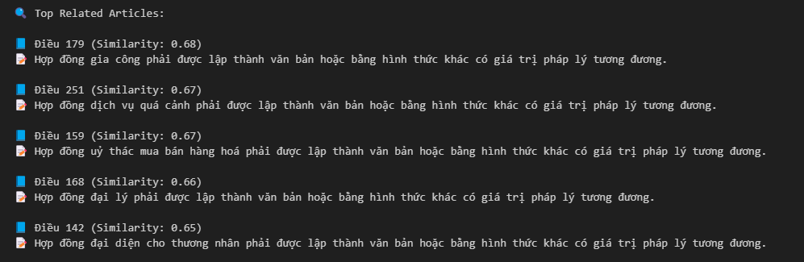

# 🧠 Legal Doc AI

Legal Doc AI is a smart document analysis and search assistant built to handle legal texts. It allows users to input natural language queries and returns relevant legal documents with visualized highlights.

## 🚀 Features

- 🔍 Natural language legal document search
- 📄 Intelligent document understanding
- 📊 Visual output with matched keywords and relevance
- 🤖 Designed for legal professionals, researchers, and students

## 🖼️ Demo

### 🔹 Input
User inputs a legal query to search documents.

### 🔹 Output
The system visualizes the most relevant matches from the legal documents.

## 🏗️ Tech Stack

- Python
- NLP / Transformer Models
- Matplotlib / Seaborn for visualization

## 👨‍💻 Author

Phan Anh Kiet – [phananhkiet0825@gmail.com](mailto:phananhkiet0825@gmail.com)

---

Feel free to use, contribute, or share. Star ⭐ the repo if you like it!
